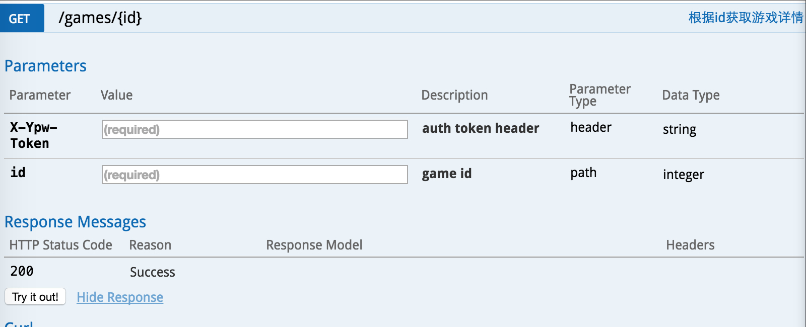

## 背景
 (游品位) 是一个安卓端的精品游戏应用商店。最近服务端进行了一次架构的重新设计，其中最重要的就是对数据接口进行RESTful改造。
 
 由于历史原因，项目初期的接口仅仅把HTTP协议作为通信协议，应用层协议藏在客户端POST过来的json数据中，这样做的优点只能规避部分浏览器对于url长度不能大于2k的限制(其实只有万恶的IE)，而缺点很明显：需要重新发明轮子再进行一层routing；数据不透明，对程序员不友好，尤其是需要数据分析或者查找线上问题的时候；几乎很难在客户端和HTTP层进行缓存等等。
 
 API设计有多种风格，目前主流的是RESTful和SOAP，这两种在不同的业务场景下，各有优劣，只是在移动互联网开发环境下，趋势是RESTful正在占据绝大部分的份额。
 
 由于网络上对于RESTful的介绍已经很多，推荐大家通过 [理解RESTful架构(阮一峰)](http://www.ruanyifeng.com/blog/2011/09/restful.html)， 或者 是Roy Thomas Fielding的[博士论文](http://www.ics.uci.edu/~fielding/pubs/dissertation/top.htm) 来了解。
 
 本文主要是自己在项目的RESTful API设计实践过程中的一些经验教训和思考，希望和大家一起讨论和分享。

## RESTful API的好处

	 1. 自解释性强，对程序员友好。CRUD 分别使用不同的HTTP动词 GET/POST/PUT/DELETE/PATCH。
	 2. 基于标准HTTP协议。如无必要，勿增实体。费尽心思规划设计出来的通信协议，未必如http协议这样完整。
	 3. 丰富的开发支持，无论手机端，web端、服务端，测试、文档、分析系统都有丰富
	 的库支持。这点很重要，尤其是在开源事业如火如荼的年代，试图自己创造出一套逻辑，
	 在开发、测试、部署等等所有环境，都会有一种无所适从的感觉。

## 设计RESTful API的原则:

在设计RESTful API的过程中有一个重要原则：

	当标准合理的时候遵守标准。

这个原则包含的意思是:

	1. RESTful是一个完整的设计体系，设计的时候尽量遵守标准。
	2. RESTful只是一种API设计的风格，并不是什么法律。当设计不符合产品业务发展或者标准存在缺陷或风险的时候，需要敢对RESTful说不。
	

## 举例

为了更好地说明RESTful API的设计，这里以 `(游品位)` 为例。`游品位` 的愿景是希望搭建一个游戏和人的联接器，所有API设计中最重要的两个资源就是 `游戏` 和 `人`。
	
## 命名以及动词的使用

1. 资源都是复数名词。例如 /games是一个游戏列表，/games/1 表示id为1的游戏，/users/1 表示id为用户. /games/1/comments 表示id为1的游戏的评论列表。命名是RESTful的精髓所在。
2. 使用合适的动词， GET /games/1 表示获取id为1的游戏数据，POST /games/1/comments 表示在id为1游戏下创建一条评论资源，DELETE /comments/1 表示删除一个评论， PATCH /users/1 表示修改用户的个人信息。HTTP协议的动词基本上覆盖了CRUD操作。
3. 不要过度抽象，一个url只做一件事. 过度抽象意味着参数过多，耦合紧。例如，在游品位中，有各种各种各样的游戏专区，比如 `热门游戏`， `最新游戏`， `内测游戏`等等，还有各种各样的筛选和排序规则。如果都使用 `/games` + `各种参数`的话，那么`/games`的参数将多到可怕，非常不适合客户端的调用。而且那么多的参数耦合在一个接口中，一旦这个接口出现问题, 影响面积将会非常的大。于是我们将 `/games` 拆分成了 `/games/hot`, `/games/new`, `/games/beta` 等等。
4. 对于不符合CRUD的操作，比如`/search`, `/login`， `/logout`，没有办法转换为资源的，那就这样好了，千万不要为了保证endpoint的 `“纯粹性”` 而丧失了RESTful最重要的可读性。
5. 不同的浏览器会对url的长度有限制(小贴士：这个并不是HTTP协议的限制，只是不同的浏览器有不同的长度限制，其中IE的限制是2083个字节，后来被谣传成HTTP协议对url长度有2KB的限制)。为了减少不必要的麻烦，当某些`查询请求` 确实可能出现请求参数较长的情况下，合理的变通，使用POST并无不妥。例如 游品位 中有一个接口是用来查询用户手机上是否有游戏需要更新，当用户手机上需要查询的游戏数量较多的情况下，如果将参数都附着在url上的话，可能会导致url长多超出限制。如果采用分次请求的话又会导致接口的调用复杂化，在这种情况下，我们设计了 `POST /users/mine/update` 接口。
6. 接口中的资源会和数据库表很像，但不要强行统一响应层和存储层的数据格式。保持后端的层次分明，去耦合，有利于后续功能的修改和迭代。

### 版本放在url里

## 文档

文档的问题在于：

	1. 易于腐烂。尤其对于快速迭代的系统来说，接口的参数，返回的数据类型时刻都有增删改的可能
	很容易出现实际接口修改了，而文档没有跟上的情况，导致文档失去了原有的意义。
	2. 开发不友好。一般存储在wiki上的文档，和开发、测试环境脱离，不利于前端开发人员的调用。

对此，我们的解决方案是：
	
	将遵守格式的文档写在代码中
	
将文档写在代码中，有利于后台开发人员在接口变动的时候及时的修改文档。而我们使用了 `swagger` 文档协议，只要文档遵循固定的格式，就可以利用 `swagger` 丰富的插件，自动的生成一份在线的文档，而且有些插件还搭配了一套api的开发调用环境。

使用swagger 文档协议，支持工具较多，可以轻松生成各种格式的文档。

## 通信数据格式

	1. 用且仅使用json。可读性，易读性大于天。
	2. 使用gzip。压缩数据大小的意义不在于节省流量，毕竟手机上随便一张图的大小都是api响应的几十倍。压缩大小的意义在于提高传输速度。
	3. 返回值自动加载嵌套数据，但不要嵌套过深。严格的RESTful对于资源列表的响应要求是返回由资源地址组成的链接列表，
	然而这种方式并不利用前端开发的调用，增加了前端调用的复杂性。因此，需要适当地展开资源的嵌套数据。

## 缓存系统
REST充分利用了HTTP协议的缓存，而HTTP缓存从优先级上有以下几种：

	1. Cache-Control：指明当前资源的有效期，控制浏览器是否直接从浏览器缓存取数据还是重新发请求到服务器取数据。
	例如在header中设置 Cache-Control: max-age=300; 客户端会在300s内不会请求服务端数据。
	2. Last-Modified/If-Modified-Since：服务端比对客户端资源的修改时间来决定是返回完整的响应数据，
	还是告诉客户端从本地的缓存中读取(304状态码)。
	3. ETag：跟上面的设置相似，只不过服务端比对的是数据的摘要来决定是返回数据还是304状态码。

其中 `Cache-Control` 能够极大的减少服务端的负载压力。另外两种设置并不会减轻服务端的负载，但是可以减少网络传输的数据流量，提高客户端的加载速度。

## 安全性

体现在：

	1. 一定要使用HTTPS。
	2. 每个请求都需要鉴权。
	3. 使用rate-limit。
	4. GET请求对系统没有影响，PATCH/PUT/DELETE 是幂等的，POST是不安全的。
	6. 对于POST请求，使用ETag可以一定程度防止重放的攻击。
	7. 对请求参数添加参数内容签名。

## 总结

	1. RESTful API有很多优点，但不要拘泥。要充分的理解项目的业务逻辑，选择最合适自己系统的设计。
	2. API的设计不是服务端一个人的事情，要和前端的开发人员进行充分的沟通，学会聆听他们的声音。
	
